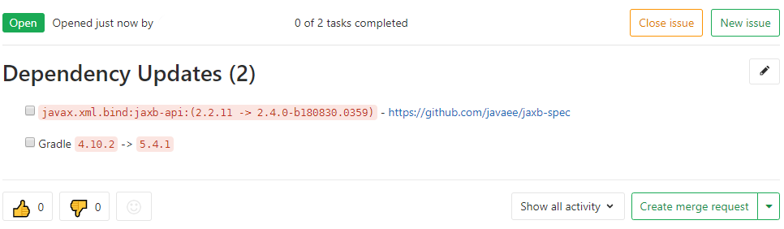

# Dependency Update Notifier (Gradle Plugin)

[](https://github.com/muhlba91/gradle-dependency-update-notifier/actions)
[](https://plugins.gradle.org/plugin/org.muehlbachler.gradle.plugin.dependency-update-notifier)
[](https://github.com/muhlba91/gradle-dependency-update-notifier/releases)
[](https://muhlba91.github.io/gradle-dependency-update-notifier)
[](https://github.com/muhlba91/gradle-dependency-update-notifier/blob/master/LICENSE)
[](https://sonarcloud.io/dashboard?id=org.muehlbachler.gradle.plugin.dependency-update-notifier)
[](https://sonarcloud.io/component_measures/metric/security_rating/list?id=org.muehlbachler.gradle.plugin.dependency-update-notifier)
[](https://sonarcloud.io/component_measures/metric/coverage/list?id=org.muehlbachler.gradle.plugin.dependency-update-notifier)
[](https://sonarcloud.io/component_measures/metric/reliability_rating/list?id=org.muehlbachler.gradle.plugin.dependency-update-notifier)
[](https://sonarcloud.io/component_measures/metric/security_rating/list?id=org.muehlbachler.gradle.plugin.dependency-update-notifier)
[](https://snyk.io/test/github/muhlba91/gradle-dependency-update-notifier?targetFile=build.gradle)
<a href="https://www.buymeacoffee.com/muhlba91" target="_blank"></a>

This Gradle plugin creates GitLab issues for outdated project dependencies found by the [Gradle Versions Plugin](https://github.com/ben-manes/gradle-versions-plugin).

Link to the [Gradle Plugin Registry](https://plugins.gradle.org/plugin/org.muehlbachler.gradle.plugin.dependency-update-notifier).

---

## Documentation

The documentation can be found [here](https://muhlba91.github.io/gradle-dependency-update-notifier).

---

## Usage

### `plugins` block:

Build script snippet for plugins DSL for Gradle 2.1 and later:

```groovy
plugins {
  id "org.muehlbachler.gradle.plugin.dependency-update-notifier" version "$version"
}
```

### `buildscript` block:

Build script snippet for use in older Gradle versions or where dynamic configuration is required:

```groovy
apply plugin: "org.muehlbachler.gradle.plugin.dependency-update-notifier"

buildscript {
  repositories {
    maven { url "https://plugins.gradle.org/m2/"}
  }

  dependencies {
    classpath "org.muehlbachler.gradle.plugin.dependency-update-notifier:$version"
  }
}
```

### GitLab Issue Notifier

After configuring the plugin and executing `dependencyUpdates` from the *Versions plugin*, you can run

```
gradle gitlabDependencyUpdateNotifier
```

to create an issue like:



---

### Commit Message

This project follows [Conventional Commits](https://www.conventionalcommits.org/), and your commit message must also
adhere to the additional rules outlined in `.conform.yaml`.

---

## Release

To draft a release, use [standard-version](https://github.com/conventional-changelog/standard-version):

```bash
$ standard-version
# alternatively
$ npx standard-version
```

Finally, push with tags:

```bash
$ git push --follow-tags
```

---

## Contributions

Please feel free to contribute, be it with Issues or Pull Requests! Please read
the [Contribution guidelines](CONTRIBUTING.md)

## Supporting

If you enjoy the application and want to support my efforts, please feel free to buy me a coffe. :)

<a href="https://www.buymeacoffee.com/muhlba91" target="_blank"></a>
